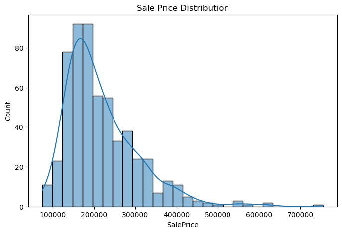
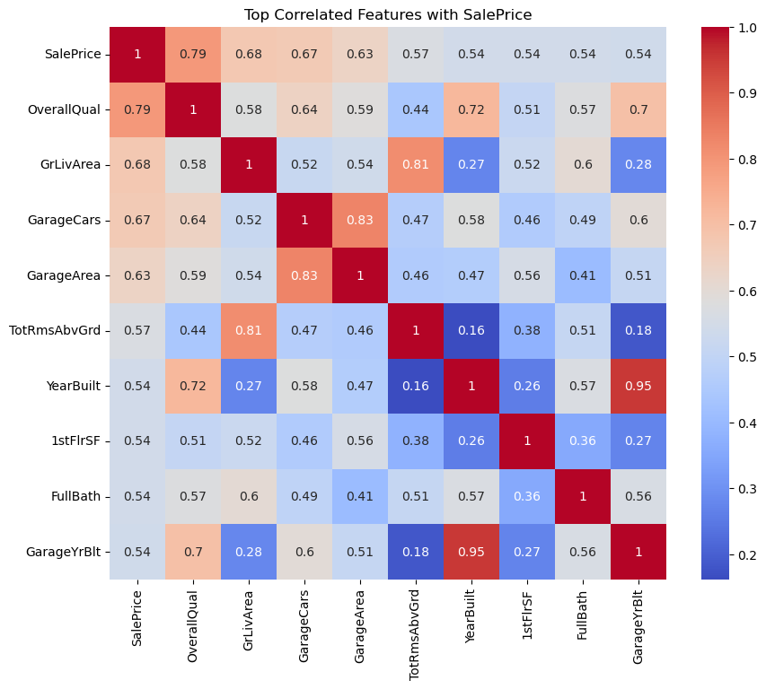

# 🏠 House Price Prediction using Random Forest

This project predicts house sale prices using structured data and a machine learning regression model. The model is trained on the [Kaggle House Prices Dataset](https://www.kaggle.com/competitions/house-prices-advanced-regression-techniques/overview) and deployed for live prediction.

---

## 🎥 Demo Video

[  
▶️ Click above to watch the 5-minute demo video.

---

## 🚀 Live App

🔗 [Try the Web App on Streamlit](https://houseprediction-id9cwetbowd8blausjihe8.streamlit.app)

---

## 📊 Project Highlights

- Cleaned and visualized structured housing data
- Engineered features for better predictions
- Trained a **Random Forest Regressor**
- Evaluated using **Root Mean Squared Error**
- Visualized results, feature importances, and prediction accuracy

---

## 📈 Visualizations

### 🔹 Sale Price Distribution


### 🔹 Feature Correlation Heatmap


---

## 🧠 Model Summary

| Step                 | Action                      |
|----------------------|------------------------------|
| Model                | RandomForestRegressor        |
| Metric               | RMSE                         |
| Data Split           | 80% Training / 20% Testing   |
| Feature Engineering  | One-hot encoding, null removal, duplicate removal |

---

## 📄 Presentation Slides

📥 [Download Slides ](House_Price_Prediction_Presentation.pptx)

---

## 🔗 Social Media Promotion

- 🔹 [LinkedIn Post](https://www.linkedin.com/in/your-profile/)
- 🔹 [YouTube Demo](https://youtu.be/-nLNFz8xcP0)
---

## 🛠 How to Run

1. Clone the repo:
   ```bash
   git clone https://github.com/MoazMohamed100/House_prediction.git
   cd house-price-predictor
